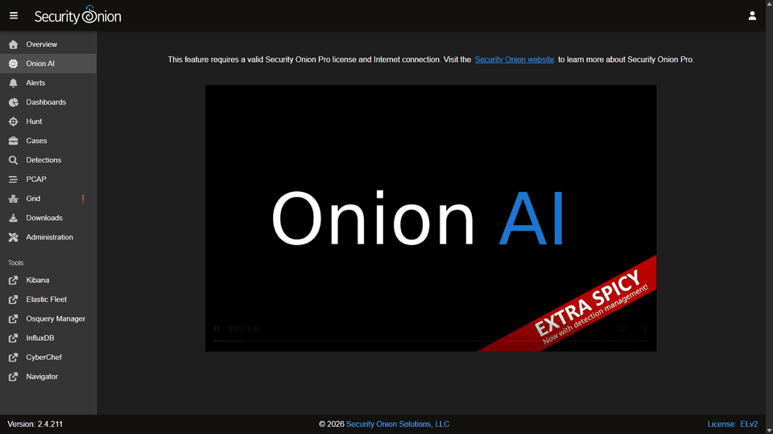
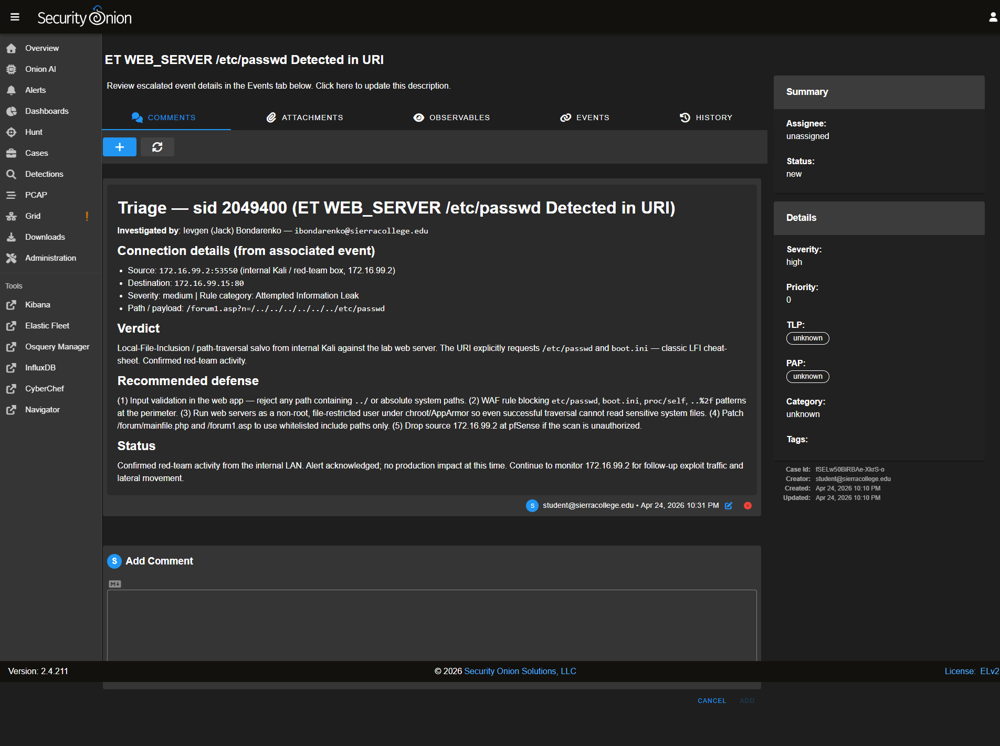
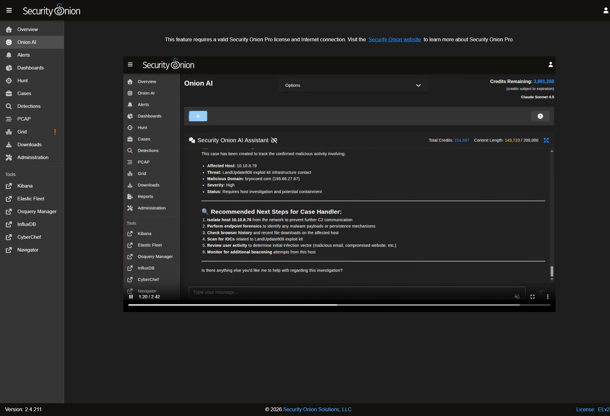
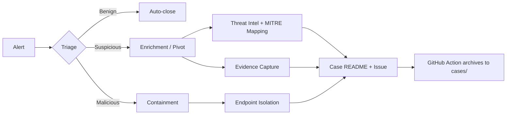

....# SOC Investigations Repository

Documenting SOC investigations and incident-response writeups in a consistent, reproducible format. Includes hands-on lab work on Security Onion (SierraLab IT-115 environment) and structured practice cases from the LetsDefend SOC Analyst training path.

**[Browse the case index ->](cases/INDEX.md)**

---

## What this looks like

Animated walkthrough of the Security Onion console used for hands-on cases (Onion AI → Alerts → Hunt → Cases → case detail → Detections → Dashboards → PCAP → Grid):



A real investigation page from this lab — `ET WEB_SERVER /etc/passwd Detected in URI`, full triage, recommended defense and verdict ([case-65](cases/case-65/)):



Cases dashboard — 27 open SO cases on the lab sensor:


Onion AI — DNS resolution summary identifying a single internal host resolving a malicious domain ([case-66](cases/case-66/)):



---

## Case counter

<p align="center">
  
</p>

---

## Repository Structure

```
SOC-Investigations/
|-- .github/
|   |-- ISSUE_TEMPLATE/
|   |   `-- new-case.yml         # Issue form for opening a new case
|   `-- workflows/
|       `-- generate-case.yml    # Auto-creates cases/case-N/ from issues
|-- cases/
|   |-- INDEX.md                 # Categorized case index
|   `-- case-NN/                 # Investigation folders
|       `-- README.md            # Final SOC case report
|-- templates/
|   |-- case_template.md         # Manual case template
|   `-- issue_template.md        # Markdown issue body template
`-- README.md
```

---

## Hands-on vs. Practice

This repo contains **two kinds** of cases - they are kept in the same format but are clearly separated:

| Type | Source | Examples |
|------|--------|----------|
| **Hands-on lab** | SierraLab IT-115 Security Onion lab. Investigation driven through Hunt -> Cases -> so-pcap on a real sensor. | case-63 (PCAP triage), case-64 (SSH brute-force), **case-65 (LFI detection)**, **case-66 (malicious DNS resolution)** |
| **SOC training** | LetsDefend SOC Analyst path - practice writeups in incident-response format. Each tagged with a Source disclaimer. | case-17 - case-62 |

The goal is the same: produce a reproducible, MITRE-mapped, evidence-driven writeup of every alert worth opening.

---

## How to Open a New Case

1. **Issues -> New Issue -> "New SOC Case"** (uses the issue form)
2. Fill in: Case Title, Source/Environment, Severity, Summary, Timeline, IOCs, MITRE, Mitigation, Lessons
3. Submit (label `new-case` is auto-applied)

A GitHub Action picks it up and auto-creates `cases/case-N/README.md` with the issue body. You can later add `evidence/` subfolder with redacted log excerpts or screenshots.

---

## Standard Case Format

Every case README follows this skeleton - see [`templates/case_template.md`](templates/case_template.md):

- **Executive Summary** (2-4 sentences)
- **Timeline** (key timestamps)
- **IOCs / Artifacts**
- **Technical Analysis** (pivot trail)
- **Mitigation / Response Actions**
- **MITRE ATT&CK Mapping**
- **Lessons Learned**
- **Tooling**

---

## Investigation Pipeline



---

## Author

[Ievgen Bondarenko](https://github.com/ibondarenko1) - SOC Analyst / Security Researcher
