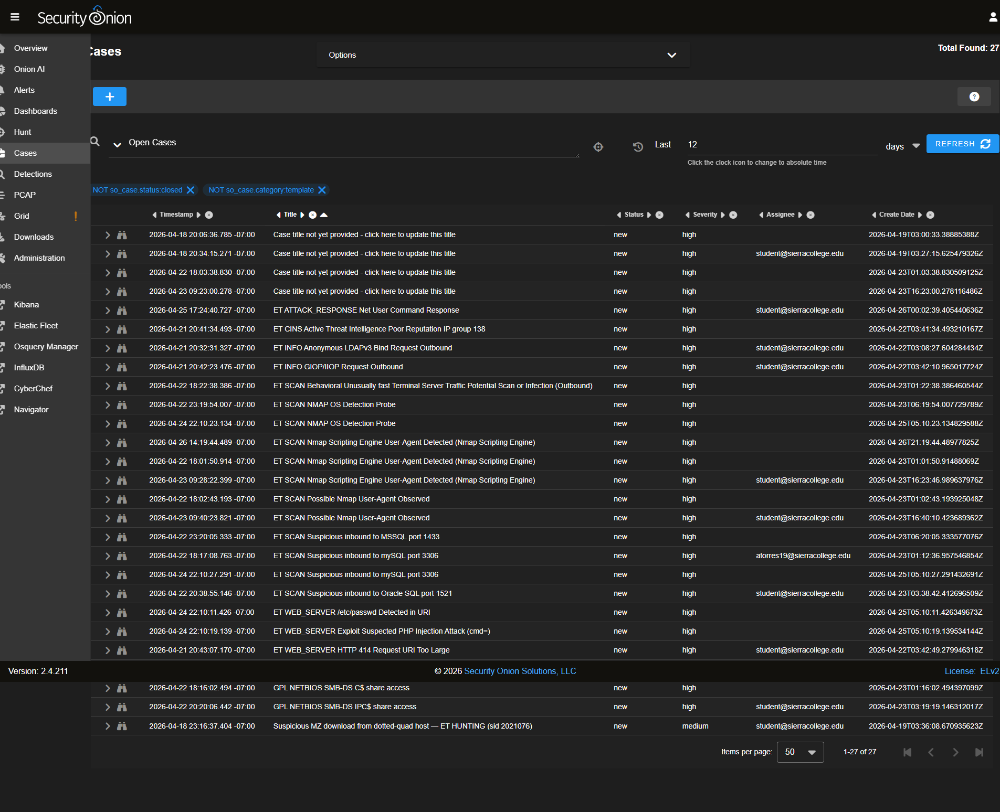
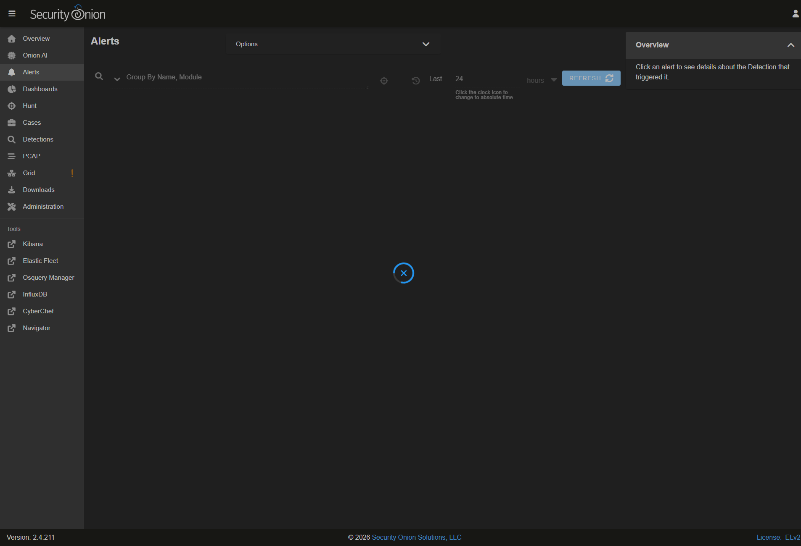
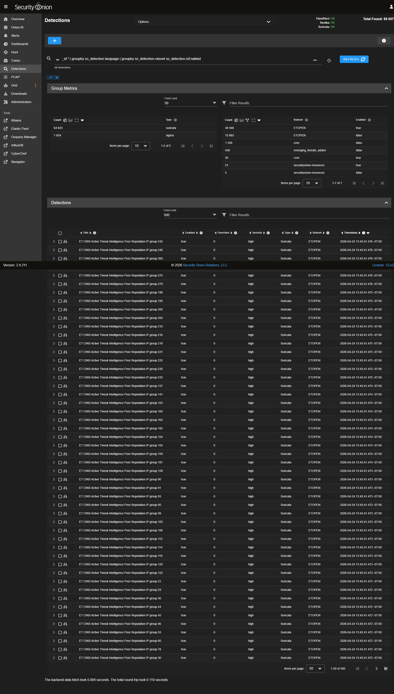

# [CASE] LFI /etc/passwd Detection on Internal Web Server

> **Source:** SierraLab IT-115 Security Onion lab — hands-on investigation. Sensor `sierralabseconion` (SO 2.4.211, IP `172.16.99.200`). Internal red-team / blue-team exercise on the lab segment `172.16.99.0/24`. No production data.


### Case ID (slug-friendly)
lfi-etc-passwd-2026-04-24

### Case Title
ET WEB_SERVER /etc/passwd Detection — internal Kali → lab web server

### SO Case Reference
`fSELw50BiRBAe-XkrS-o` (created 2026-04-24 22:10 PDT, severity `high`)

### Executive Summary
Suricata rule `sid 2049400 — ET WEB_SERVER /etc/passwd Detected in URI` fired on the internal sensor. The URI `/forum1.asp?n=/../../../../../../etc/passwd` was sent from internal Kali host `172.16.99.2:53550` to lab web server `172.16.99.15:80`. Pattern matches a textbook LFI / path-traversal probe. Confirmed authorized red-team activity (lab exercise); alert acknowledged, no production impact.

### Timeline (Key Timestamps, lab time)
- 2026-04-24 22:10 PDT — SO Case opened (`fSELw50BiRBAe-XkrS-o`).
- T+0 — Suricata triggered ET 2049400 on the lab sensor.
- T+5m — Pivot from Alerts to Cases dashboard; attached event reviewed.
- T+15m — Verdict written: confirmed authorized red-team probe.
- 2026-04-24 22:31 PDT — Triage note + Recommended Defense + Status posted as case comment.

### Artifacts / Indicators of Compromise (IOCs)
- **Suricata SID:** 2049400 — *ET WEB_SERVER /etc/passwd Detected in URI*
- **Source:** `172.16.99.2:53550` (internal lab Kali / red-team host)
- **Destination:** `172.16.99.15:80` (lab IIS / web server)
- **Severity / category:** medium / Attempted Information Leak
- **Path / payload:**
  ```
  /forum1.asp?n=/../../../../../../etc/passwd
  ```

### Technical Analysis

1. **Trigger.** Suricata's ET `WEB_SERVER` ruleset includes `/etc/passwd` and `boot.ini` literal-string matches in HTTP URI. The captured request had six `../` segments followed by `etc/passwd`, hitting the rule on the URI inspection buffer.
2. **Direction.** Source is the lab's red-team Kali (`172.16.99.2`); destination is the in-lab IIS web server (`172.16.99.15`). Both are inside the same lab segment, so the alert is **intra-LAN**, not perimeter ingress.
3. **Endpoint vs URI mismatch.** The request URI was an `.asp` (IIS) path, but the payload was a Linux-shaped traversal (`/etc/passwd`). On a real IIS host this would normally fail; the rule still fires on signature alone. This is typical for automated scan tooling that throws OS-agnostic payloads regardless of target stack.
4. **Validation that this is exercise traffic.** Source was the known internal Kali address; matching follow-up traffic from the same `172.16.99.2` confirmed it was a coordinated probe sequence (additional ET `SCAN` and `INFO_LEAK` events visible in the Cases dashboard, screenshots in `evidence/`). No external IP involved.
5. **Defense-in-depth review (recorded as Recommended Defense in the SO case):**
   - Input validation in the web app — reject any path containing `../` or absolute system paths.
   - WAF rule blocking `etc/passwd`, `boot.ini`, `proc/self`, `..%2f` patterns at the perimeter.
   - Run web servers as a non-root, file-restricted user under chroot / AppArmor so even successful traversal can't reach sensitive system files.
   - Patch `/forum/mainfile.php` and `/forum1.asp` to use whitelisted include paths only.
   - Drop source `172.16.99.2` at pfSense if the scan is unauthorized.

### Mitigation / Response Actions
- Verified: authorized red-team probe from internal Kali host.
- SO Case acknowledged; no production impact (lab segment).
- Continue to monitor `172.16.99.2` for follow-up exploit traffic and lateral movement.


### Evidence (Security Onion console screenshots)

**Live SO case page** — full triage record `fSELw50BiRBAe-XkrS-o`:


**Cases dashboard** — this case in context with 26 other open SO cases:



**Alerts view** — the analyst view that pivots into the case:



**Detections** — Suricata rule catalog (where the LFI signature lives):



### MITRE ATT&CK Mapping
- **T1190** — Exploit Public-Facing Application
- **T1083** — File and Directory Discovery (intent of LFI payload)
- **T1003.008** — OS Credential Dumping: /etc/passwd and /etc/shadow

### Lessons Learned
- The `WEB_SERVER` ETPRO rules trigger on a string buffer, not on actual server OS — useful as broad coverage, but the **content of the alert** is still signal: someone is throwing path-traversal at internal services.
- Always cross-reference the source IP against known authorized scanners. An identical signature from an unknown internal IP would have escalated this from `acknowledged` to `containment`.
- LFI payloads in URLs are a free reconnaissance pass — they cost the attacker nothing and produce a usable signal in the SIEM. Tightening input validation in lab apps closes a very cheap detection that real-world attackers also use.

### Tooling
- Security Onion 2.4.211 — Cases, Alerts, Hunt
- Suricata + ETPRO ruleset
- Zeek (HTTP logs would carry the request body for further triage)
