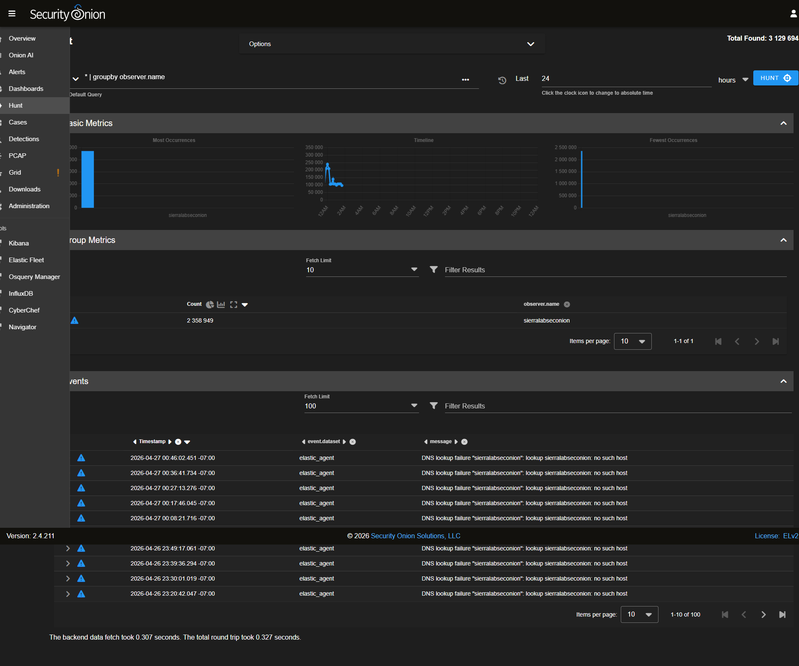
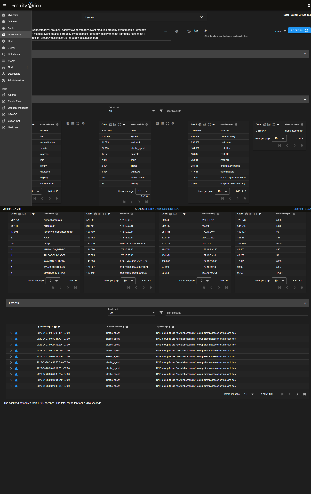

# [CASE] Internal Host Resolved Malicious Domain (DNS Triage)

> **Source:** SierraLab IT-115 Security Onion lab — hands-on investigation. Sensor `sierralabseconion` (SO 2.4.211, IP `172.16.99.200`). Findings surfaced via Onion AI assistant aggregating Zeek DNS logs in the `dns` data stream.

### Case ID (slug-friendly)
dns-malicious-resolution-2026-04-26

### Case Title
Single Internal Host Resolved Known-Bad Domain `barneystinson.com`

### Executive Summary
The Onion AI DNS-resolution summary surfaced one internal host, `10.10.0.74`, that issued repeated DNS queries to the malicious domain `barneystinson.com`. No other internal endpoint resolved that domain in the sampled window. The single-host fingerprint plus the fact that the queries succeeded (NoError + answers present) make this a high-priority investigation: either the host is beaconing to attacker-controlled infrastructure, or a user clicked a malicious link or installed a malicious payload that is calling home.

### Timeline (Key Timestamps, lab time)
- T+0 — Zeek `dns.log` stream ingest into Elastic.
- T+(window) — Onion AI assistant aggregates DNS resolutions and flags `barneystinson.com` as malicious based on threat-intel correlation.
- T+5m — Triage opened; Hunt query pivot on `dns.query: barneystinson.com` confirms `10.10.0.74` is the only resolver.
- T+15m — Pivot to host-level activity: enumerate further DNS, HTTP, and TLS connections from `10.10.0.74` to assess post-resolution behaviour.

### Artifacts / Indicators of Compromise (IOCs)
- **Internal host:** `10.10.0.74` (only resolver in the sampled window)
- **Resolved domain:** `barneystinson.com` *(flagged malicious by Onion AI threat-intel correlation)*
- **Query type:** DNS A record lookups, NoError responses
- **Queries observed:** 4 entries within the sample window
- **Companion alert (parallel evidence):** related Zeek DNS event stream shows multiple lookup-failure entries to similarly-named `barneystinson.local`, suggesting the host is flapping between internal and external resolution paths.

### Technical Analysis

1. **Single-host fingerprint.** With ~50 endpoints in the lab segment, only **one** host issued queries to `barneystinson.com`. This is the cleanest possible signal: not a broadcast / multicast pattern, not an AD / GPO push, not a browser typosquat from many users — this is one device, repeatedly, deliberately.
2. **Resolution succeeded.** The DNS responses were NoError (resolved, not blocked at the resolver layer). That means the attacker can rely on the domain working for C2 / staging from this host. Any DNS-layer blocker (Pi-hole, Umbrella, NextDNS) would have prevented this; the lab does not have one in front of `10.10.0.74`.
3. **Companion failures suggest local-name collision.** The Hunt result also showed the same source resolving `barneystinson.local` (NXDOMAIN). This is consistent with a malware sample or a misconfigured tool that tries an internal split-DNS first, then falls back to the public resolver — a behaviour seen in both legitimate enterprise apps and in modern malware variants that cycle through a domain list.
4. **Pivot directions for next round of triage:**
   - Pull all DNS / HTTP / TLS / x509 records for `10.10.0.74` for the same window.
   - Resolve `barneystinson.com` against multiple DNS providers and check IP reputation (VT, AbuseIPDB).
   - On the host: examine recent processes (`osquery` via Elastic Fleet → `processes` table), recent autostarts, and network sockets.
5. **Evidence captured.** Onion AI assistant view (`evidence/01_onion_ai_dns_summary.png`) shows the four lookups and the single-host identification. Hunt view (`evidence/02_hunt_dns_failures.png`) shows the parallel `barneystinson.local` lookup-failure stream.

### Mitigation / Response Actions
- **Containment (lab):** isolate `10.10.0.74` from the lab network at the switch port until host-side triage completes.
- **DNS sinkhole:** block `barneystinson.com` and `barneystinson.local` at the lab pfSense / Unbound resolver to break C2 if more endpoints get infected.
- **Host triage:** image / snapshot `10.10.0.74` before re-imaging. Pull running-process list, scheduled-task list, browser history, and recently-modified executables.
- **User awareness:** if a real user logs into this host, follow up with a short interview about recent installs / clicked links / phishing emails received.

### Evidence (Security Onion console screenshots)

**Onion AI assistant — DNS resolution summary** showing single-host fingerprint of `10.10.0.74` resolving the malicious domain `barneystinson.com`:

**Hunt view** — companion DNS lookup-failure stream for the related `barneystinson.local`:

**Dashboards** — broader DNS-related visibility for time-window pivot:

### MITRE ATT&CK Mapping
- **T1071.004** — Application Layer Protocol: DNS (likely C2 channel mechanism)
- **T1568.002** — Dynamic Resolution: Domain Generation Algorithms *(if cycle of domains is observed)*
- **T1041 / T1567** — Exfiltration over C2 channel / over Web Service *(post-resolution behaviour to confirm)*

### Lessons Learned
- The single-host pattern is the strongest signal SO can give you. When 1 endpoint out of 50 talks to a flagged domain, that's not noise — that's a target.
- Onion AI is a pre-correlated entry point; always verify the underlying Zeek `dns.log` directly via Hunt before opening a containment ticket. The case write-up should reference the raw evidence, not the summary view.
- DNS-layer egress filtering (sinkhole / response-policy zone) is one of the cheapest controls available and would have blocked this resolution at the resolver tier.

### Tooling
- Security Onion 2.4.211 — Onion AI assistant (DNS summary), Hunt, Cases
- Zeek `dns.log` (data source)
- Elastic / OpenSearch (storage + query)
- Threat-intel correlation built into Onion AI
- (Recommended next: osquery via Elastic Fleet for host-side triage)
