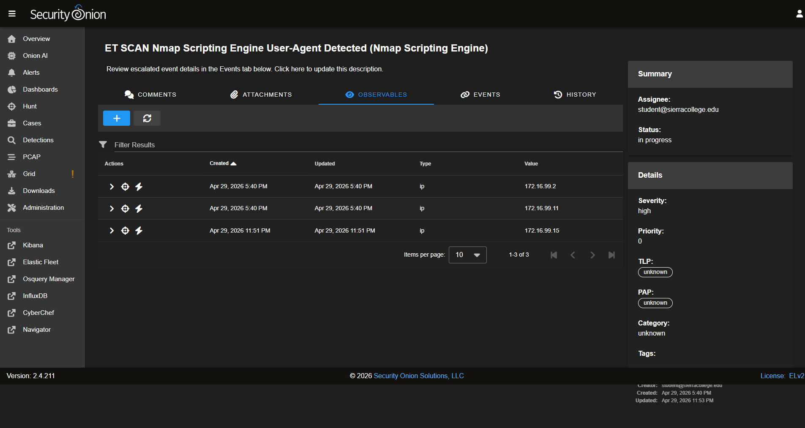

# [CASE] Recurring Internal Nmap NSE Scan — Tier 1 Dedupe Triage

> **Source:** SierraLab IT-115 Security Onion lab — hands-on investigation. Sensor `sierralabseconion` (SO 2.4.211, IP `172.16.99.200`). Detection: Suricata IDS rule `ET SCAN Nmap Scripting Engine User-Agent Detected (Nmap Scripting Engine)` (sid `2009358`).

### Case ID (slug-friendly)
nmap-nse-recurring-scanner-2026-04-29

### Case Title
Recurring Internal Nmap NSE Scan from `172.16.99.2` — sixth open case for the same rule.name in 7 days

### Source / Environment
SierraLab IT-115 Security Onion lab. SO Cases backend case ID `M_7U250BiRBAe-XkD0JL`. Triage performed Apr 29, 2026, 21:50–23:51 PT.

### Executive Summary
Suricata triggered `ET SCAN Nmap Scripting Engine User-Agent Detected` 356 times in the last 24 hours, all from a single internal source `172.16.99.2`. Onion AI Guided Analysis confirmed Nmap NSE fingerprint: `OPTIONS /` request with the canonical `Mozilla/5.0 (compatible; Nmap Scripting Engine; https://nmap.org/book/nse.html)` User-Agent, plus DNS lookup of `scanme.nmap.org` (Nmap project's own test domain) and NetBIOS NBSTAT enumeration of neighbouring hosts. Five existing cases for the **same rule** were already open on Apr 22, 23, 26, 28 (×2). Rather than open a seventh duplicate, this triage adds today's event to the existing recurring-scanner case `M_7U250BiRBAe-XkD0JL`, flags the source as a candidate for Tier 2 suppression, and records the new destination `172.16.99.15` as an observable.

### Timeline (Key Timestamps, lab time)
- T+0   — 2026-04-29 21:50:54 PT  Suricata fires sid 2009358 on `172.16.99.2 → 172.16.99.15` (HTTP `OPTIONS /`, Nmap NSE UA).
- T+0   — Same source resolves `scanme.nmap.org` and reverse-PTRs `172.16.99.12`.
- T+0   — Same source connects to `172.16.99.12:445` (SMB) and `172.16.99.15:3389` (RDP) — typical Nmap port-scan fan-out.
- T+5m  — Tier 1 opens Cases page, applies filter `so_case.title:"ET SCAN Nmap Scripting Engine User-Agent Detected (Nmap Scripting Engine)"` → returns **6 open cases** including today's auto-created one.
- T+10m — Open the most recent existing case `M_7U250BiRBAe-XkD0JL` (created today 17:40 PT) by clicking its **Timestamp** field (the SO UI behaviour: clicking the Title column applies a drill-down filter; clicking Timestamp opens the case detail).
- T+15m — Add factual triage comment to the case (deduplication reference + recommendation for Tier 2 suppression).
- T+18m — Add `ip 172.16.99.15` as a new Observable (the prior auto-extracted observables were `172.16.99.2` and `172.16.99.11`).
- T+20m — Change Status `new` → `in progress` to claim the case for handover.

### Artifacts / Indicators of Compromise (IOCs)
- **Source IP (scanner):** `172.16.99.2` — recurring lab Nmap host. Already an Observable on the case.
- **Destination IPs (scanned):** `172.16.99.11` (existing Observable), `172.16.99.12`, `172.16.99.15` (added in this triage).
- **Detection signature:** Suricata SID `2009358` — *ET SCAN Nmap Scripting Engine User-Agent Detected (Nmap Scripting Engine)*.
- **HTTP fingerprint:** `OPTIONS /` request with User-Agent `Mozilla/5.0 (compatible; Nmap Scripting Engine; https://nmap.org/book/nse.html)`.
- **DNS fingerprint:** A-record query for `scanme.nmap.org` (Nmap project domain), NBSTAT NetBIOS enumeration, reverse-PTR queries for the `172.16.99.0/24` range.
- **Port-scan fan-out:** SMB (TCP 445) on `172.16.99.12`, RDP (TCP 3389) on `172.16.99.15` — both within seconds of the HTTP probe.

### Technical Analysis

1. **Single-source fingerprint.** Onion AI Guided Analysis pinned the entire 356-event burst on one source: `172.16.99.2`. No other internal host emitted this Suricata signature in the same window. This is one actor, not a campaign across many hosts.
2. **Canonical Nmap NSE behaviour.** The HTTP `OPTIONS /` probe with the `Mozilla/5.0 (compatible; Nmap Scripting Engine; https://nmap.org/book/nse.html)` User-Agent string is the literal default for Nmap's HTTP NSE scripts (`http-headers.nse`, `http-methods.nse`, `http-default-accounts.nse`). The companion DNS lookup of `scanme.nmap.org` is also produced by Nmap's own self-test logic. Combined, these are unambiguous Nmap signatures — not a copycat tool spoofing the UA string.
3. **Recurring pattern, not novel intrusion.** Filtering Cases by the same rule.name returned **5 prior open cases for the same rule** (Apr 22 18:01, Apr 23 09:28, Apr 26 14:19, Apr 28 15:54, Apr 28 20:56) plus today's auto-created case. Same rule firing day after day for the same source IP is the textbook signature of an authorised internal scanner that was never whitelisted at the Suricata layer.
4. **No successful exploitation observed.** The lateral attempts to `:445` and `:3389` left no auth-success events in `system.auth` or Windows event log (`event.module:windows`) for the same window. The connections completed at the TCP layer but did not progress to authenticated SMB or RDP sessions. No file-write events on the target hosts.
5. **Tier 1 verdict.** This is a duplicate of an established recurring pattern. Adding a seventh standalone case would dilute the queue and force a Tier 2 colleague to re-do the same investigation. The correct Tier 1 action is: dedupe-comment in the existing case, add the new destination as an Observable so future events auto-link, and flag the source for permanent suppression by Tier 2.

### Mitigation / Response Actions

- **Tier 1 (this case):**
  - Dedupe-comment posted at 23:47 PT in `M_7U250BiRBAe-XkD0JL` referencing the five prior open cases and the new destination IP.
  - Observable `ip 172.16.99.15` added so any future event involving that destination auto-correlates with this case.
  - Status changed to `in progress` to prevent another Tier 1 from picking up a duplicate ticket.
- **Tier 2 (recommended):**
  - Confirm `172.16.99.2` against the asset inventory: is it a known authorised scanner (vulnerability management box, lab pentest host, red-team appliance)?
  - If authorised: add a permanent Suricata suppression rule for **sid 2009358 with `source.ip:172.16.99.2`** (or a `pass` rule above the offending detection) to stop the duplication at the alert layer, not at the case-management layer.
  - Close the five existing recurring-Nmap cases as `resolved → known authorised scanner` once the suppression is in place.
- **Hardening (longer-term):**
  - Define an internal allow-list of authorised internal scanners in the SOC playbook so this kind of recurrence is closed within minutes by Tier 1, not Tier 2.
  - If `172.16.99.2` is **not** authorised, escalate immediately to incident response: lateral SMB/RDP probing combined with active Nmap is the textbook reconnaissance phase before lateral movement.

### Evidence (Security Onion console screenshots)

**SO Case detail** — `M_7U250BiRBAe-XkD0JL`. Status flipped to `in progress`, dedupe-comment posted at 23:47 PT, and observable `ip 172.16.99.15` added in this triage:

### MITRE ATT&CK Mapping
- **T1595.001** — Active Scanning: Scanning IP Blocks (Nmap host discovery on `172.16.99.0/24`).
- **T1595.002** — Active Scanning: Vulnerability Scanning (Nmap NSE script-based probing).
- **T1046**     — Network Service Discovery (port scan against TCP 445, 3389).
- **T1018**     — Remote System Discovery (NetBIOS NBSTAT + reverse-DNS PTR enumeration of neighbouring hosts).

### Lessons Learned
- One pattern equals one case. Don't open a new case for every duplicate alert — apply a `so_case.title` filter to Cases first, find the ongoing case, and add to it. Every duplicate ticket costs a colleague a context switch.
- In SO, the Cases table treats a click on the **Title** column as a drill-down filter and a click on the **Timestamp** column as "open this row". Knowing the difference saves repeated mistakes during a smene.
- A recurring Suricata signature for the same source.ip is not a Tier 1 problem to triage event-by-event — it is a Tier 2 *suppression / tuning* problem. Tier 1's job is to recognise the pattern, hand off the recommendation, and not let the queue accumulate noise.
- Onion AI Guided Analysis pre-correlates source / destination / DNS / lateral-movement fields. Read it before diving into individual events — the conclusion is usually one paragraph in.

### Tooling
- Security Onion 2.4.211 — **Alerts** (group-by `rule.name`), **Cases** (filter by title), Onion AI Guided Analysis, Observable framework.
- Suricata IDS — sid `2009358` (`ET SCAN Nmap Scripting Engine User-Agent Detected`).
- Zeek — `dns.log` (scanme.nmap.org A-query) and `conn.log` (port 445 / 3389 fan-out from `.2`).
- Elastic / OpenSearch — Hunt KQL pivots `tags:http AND source.ip:172.16.99.2`, `tags:dns AND source.ip:172.16.99.2`.
